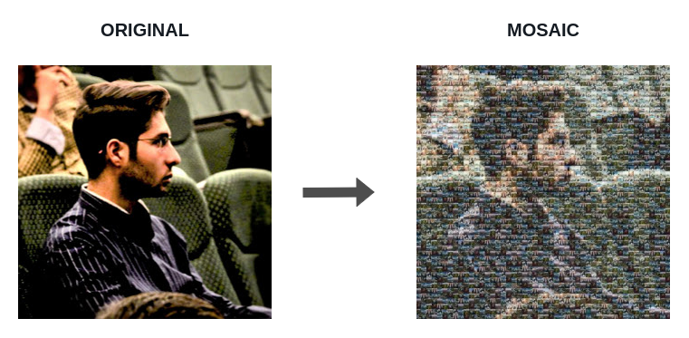

<!-- LOGO -->

  

<!-- BADGES -->

  
  
  
  
  

<!-- TITLE -->
# MOSAIC MAN
> simple but poweful mosaic picture generator
>
> it's completely free with a highly customizable mosaic server 

## RESULT

<!-- RESULT -->

  

## OPTIONS

1. tile size

2. opacity

### TODOs

- only square image is supported (width == height)

- we only support `jpg` format

- enhance mosaic algorithm

- increase tile dataset and support others rather than only cats dataset
