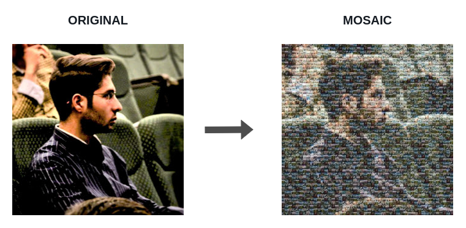

<!-- LOGO -->

  

<!-- BADGES -->

  
  
  
  
  

<!-- TITLE -->
# MOSAIC MAN
> mosaic picture generator
>
> it's completely free and a highly customizable mosaic server 

## RESULT

<!-- RESULT -->

  

## OPTIONS

1. tile repository 

2. tile size

3. transparency
